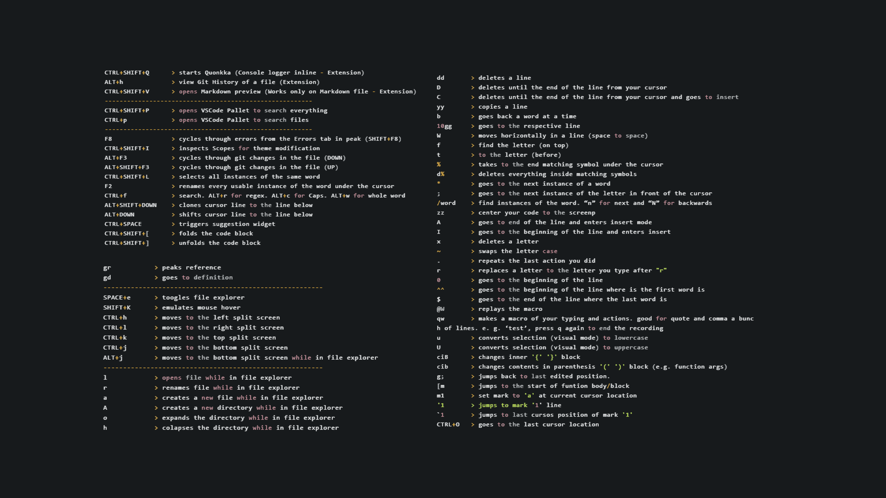

## Instructions to use Neovim inside VSCode

1 - Copy `keybindings.json` to the following location...<br>
%UserProfile%\AppData\Roaming\Code\User<br>

2 - Copy `settings.json` to the following location...<br>
%UserProfile%\AppData\Roaming\Code\User<br>

3 - Inside the `settings.json` file, change the field from "vscode-neovim.neovimExecutablePaths.win32" to your own `nvim.exe` path;

4 - Copy `.vscodeinit.vim` to the following location...<br>
%UserProfile%<br>

5 - Download this awesome Theme https://github.com/louiscavalcante/theme-anakmun <br>

6 - Install these Plugins:<br>

```
Anakmun Theme - Luiz Cavalcante
Auto Rename Tag - Jun Han
Better Comments - Aaron Bond
Bracket Pair Colorizer 2 - CoenraadS
Color Manager - Roy Action
CSS Peek - Pranay Prakash
DotENV - mikestead
ES7 React/Redux/GraphQL/React-Native - dsznajder
ESLint - Dirk Baeumer
Format on autosave - BDSoftware
Git History - Don Jayamanne
GitLens - Eric Amodio
Live Server - Ritwick Dey
Markdown All in One - Yu Zhang
npm - egamma
Nunjucks Template - eseom
PasteJSON as Code - quicktype
Prettier Code formatter - Prettier
Quokka.js - Wallaby.js
React Native Tools - Microsoft
Settings Sync - Shan Khan
VSCode Neovim - Alexey Svetliakov
vscode-icons - VSCode Icons Team
Which Key - VSpaceCode
```

7 - Shortcuts: <br>



8- Enjoy! <br>
